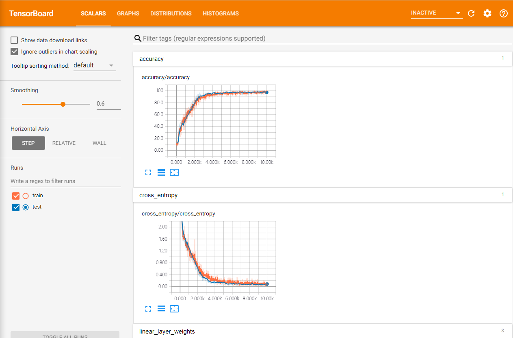
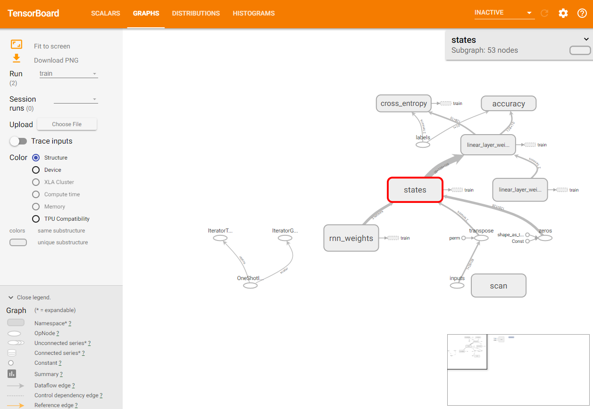
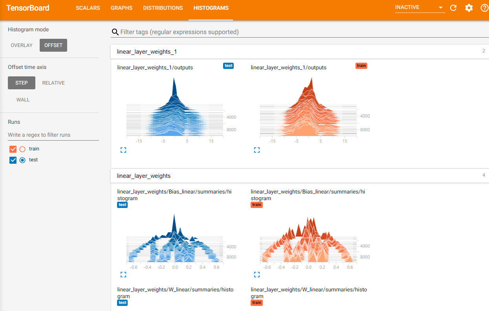
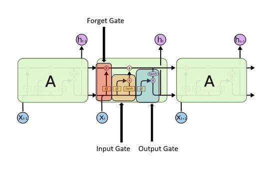

# Chap05 - 텍스트 1: 텍스트와 시퀀스 처리 및 텐서보드 시각화

> 텐서플로에서 시퀀스(sequence) 데이터인 텍스트를 어떻게 다루는지 알아보고, RNN 구현방법 및 텐서보드를 이용한 시각화에 대해 알아본다. 그 다음 단어 임베딩 학습 및 LSTM을 구현해본다.

 

## 5.1 시퀀스 데이터의 중요성

[Chap04-합성곱 신경망 CNN](http://excelsior-cjh.tistory.com/152)에서 이미지의 공간(spatial) 구조를 이용하여 CNN을 구현하였고, 이러한 구조를 활용하는 것이 중요하다는 것을 알아 보았다. 이번에 알아볼 순차형 데이터 구조인 시퀀스(sequence) 데이터 또한 중요하고 유용한 구조이다. 시퀀스 데이터란 각각의 데이터가 순서가 있는 데이터를 말하며, 다양한 분야에서 찾을 수가 있다. 예를 들어, 음성신호, 텍스트, 주가 데이터 등이 있다.


 

## 5.2 RNN 소개

**RNN(순환신경망, Recurrent Neural Network)**은 시퀀스 데이터의 모델링에 사용되는 신경망 구조이다. RNN 모델의 바탕에는 시퀀스에서 현재 이후의 각 데이터는 새로운 정보를 제공하므로, 이 정보로 모델의 현재 상태를 **'갱신(업데이트)'** 한다는 아이디어가 깔려있다.

어떤 텍스트에서 문장을 읽을 때 각각의 새로운 단어로 현재 상태의 정보가 갱신되는데 이 상태는 새롭게 나타난 단어뿐만 아니라 이전의 단어에 대해서도 종속적이다.

머신러닝에서 시퀀스 패턴의 데이터를 모델링하기 위해 흔히 사용되는 통계 및 확률기반의 [마르코프 체인](https://en.wikipedia.org/wiki/Markov_chain)(Markov Chain) 모델이다. 데이터를 시퀀스를 '체인'으로 본다면, 체인의 각 노드는 이전 노드로부터 어떤 식으로든 종속적이므로 '과거'는 지워지지 않고 이어진다.

RNN 모델 또한 체인 구조 개념을 기반으로 하고 있으며 정보를 유지하고 갱신하는 방법에 따라 다양한 종류가 있다. '순환'이라는 이름에서 알 수 있듯이 RNN은 일종의 **'루프'**로 이루어진다.


위의 그림에서 볼 수 있듯이, 시점 $t$에서 네트워크는 입력값 $x_t$ (문장 중 하나의 단어)를 관찰하고, '상태 벡터'(state vector, $t$ 시점의 출력)를 이전의 $h_{t-1}$에서 $h_t$로 업데이트 한다. 새로운 입력(다음 단어)은 $t-1, t-2, \dots$에서 관찰한 이전 입력이 현재($t$) 입력의 이해에 영향을 미치므로 과거 시퀀스에 종속적이다. 위의 그림에서 처럼, 이러한 순환구조를 길게 펼쳐놓은 체인으로 생각할 수 있다. 

 

### 5.2.1 기본적인 RNN 구현

이제 텐서플로(TensorFlow)를 사용해 시퀀스 데이터를 다루는 방법과 기초적인 RNN을 구현해보도록 하자.

먼저, RNN 모델의 업데이트 단계에 대해 알아보면 RNN의 업데이트 단계는 다음과 같이 나타낼 수 있다.


이를 수식으로 나타내면 아래와 같다.

$$
h_t = \tanh{\left( \mathrm{W}_x x_t + \mathrm{W}_h h_{t-1} + b \right)}
$$

$\mathrm{W}_x, \mathrm{W}_h, b$ 는 학습할 가중치(weight) 및 편향값(bias)의 변수이며, 활성화 함수로는 하이퍼볼릭 탄젠트 함수($\tanh$)를 사용했다. $x_t$와 $h_t$는 입력과 상태 벡터이다.

 

#### 시퀀스로서의 MNIST 이미지

텍스트 데이터 적용에 앞서, 익숙한 데이터인 MNIST 이미지 분류를 RNN 모델을 구현하여 분류 작업을 수행해보자. 

[Chap04-합성곱 신경망 CNN](http://excelsior-cjh.tistory.com/152)에서 살펴볼 수 있듯이 CNN은 이미지의 공간(spatial) 구조를 활용한다. 이미지 구조는 CNN 모델에 적합하지만, 인접한 영역의 픽셀은 서로 연관되어 있으므로 이를 시퀀스 데이터로 볼 수도 있다.

아래의 그림처럼 MNIST 데이터에서 `28 x 28` 픽셀을 시퀀스의 각원소는 `28`개의 픽셀을 가진 길이가 `28` 시퀀스 데이터로 볼 수 있다.


먼저 데이터를 읽어 들이고 매개변수 정의 및 데이터에 사용할 플레이스홀더를 만들어 준다. MNIST데이터를 불러오는 방법은 교재와는 다르다. 그 이유는 블로그 포스팅 시점인 2018.06.13(수)의 `tensorflow` 버전이 1.8인데 해당 버전에서 아래와 같이 MNIST데이터를 불러오면 Warning이 나타난다.

```python
from tensorflow.examples.tutorials.mnist import input_data

mnist = input_data.read_data_sets("../data", one_hot=True)
```
```bash
WARNING:tensorflow:From <ipython-input-1-40ec958cfe79>:3: read_data_sets (from tensorflow.contrib.learn.python.learn.datasets.mnist) is deprecated and will be removed in a future version.
```

이를 방지하기 위해 `tf.keras.datasets.mnist.load_data()`를 사용해서 MNIST데이터를 불러온다.


```python
import tensorflow as tf

#####################
# Define Parameters #
#####################
element_size = 28
time_steps = 28
num_classes = 10
batch_size = 128
hidden_layer_size = 128

# Where to save TensorBoard model summaries
LOG_DIR = "./logs/RNN_with_summaries"


# MNIST 데이터 불러오기 위한 함수 정의
def mnist_load():
    (train_x, train_y), (test_x, test_y) = tf.keras.datasets.mnist.load_data()

    # Train set
    train_x = train_x.astype('float32') / 255.
    train_y = tf.keras.utils.to_categorical(train_y, num_classes=10)
    # Test set
    test_x = test_x.astype('float32') / 255.
    test_y = tf.keras.utils.to_categorical(test_y, num_classes=10)
    return (train_x, train_y), (test_x, test_y)

# MNIST 데이터 불러오기
(train_x, train_y), (test_x, test_y) = mnist_load()

dataset = tf.data.Dataset.from_tensor_slices(({"image": train_x}, train_y))
dataset = dataset.shuffle(100000).repeat().batch(batch_size)
iterator = dataset.make_one_shot_iterator()
next_batch = iterator.get_next()
```


```python
# Create placeholders for inputs, labels
_inputs = tf.placeholder(tf.float32, 
                         shape=[None, time_steps, element_size], 
                         name='inputs')
y = tf.placeholder(tf.float32, shape=[None, num_classes], name='labels')
```

 

코드에서 각 파라미터들의 설명은 다음과 같다.

- `element_size` : 시퀀스 벡터 각각의 차원이며, 행 또는 열의 픽셀 크기인 28.
- `time_steps` : 한 시퀀스 내에 들어 있는 원소의 수.
- RNN 학습 단계에서 데이터를 입력해 줄때 `[batch_size, time_steps, element_size]`로 `reshape()` 해준다. 
- `hidden_layer_size` : 128로 설정하고 RNN의 출력 벡터(상태 벡터, state vector)의 크기를 의미한다.
- `LOG_DIR` : 텐서보드(TensorBoard) 시각화를 위해 모델의 요약 정보를 저장하는 디렉터리이다.

 

#### RNN 단계

RNN 모델 구현에 앞서 다음과 같이 텐서보드(TensorBoard)에서 모델과 학습과정을 시각화 하는데 사용할 요약을 기록하는 함수를 만들어 준다. 아래의 코드는 [tensorflow.org](https://www.tensorflow.org/programmers_guide/summaries_and_tensorboard)에서 확인할 수 있다.


```python
# 요약(summaries)을 로깅(logging)하는 몇몇 연산을 추가하는 헬퍼 함수
def variable_summaries(var):
    with tf.name_scope('summaries'):
        mean = tf.reduce_mean(var)
        tf.summary.scalar('mean', mean)
        with tf.name_scope('stddev'):
            stddev = tf.sqrt(tf.reduce_mean(tf.square(var - mean)))
        tf.summary.scalar('stddev', stddev)
        tf.summary.scalar('max', tf.reduce_max(var))
        tf.summary.scalar('min', tf.reduce_min(var))
        tf.summary.histogram('histogram', var)
```

 

다음으로 RNN 에서 사용할 가중치와 편향값 변수를 만든다.


```python
# Weights and bias for input and hidden layer
with tf.name_scope('rnn_weights'):
    with tf.name_scope('W_x'):
        Wx = tf.Variable(tf.zeros([element_size, hidden_layer_size]))
        variable_summaries(Wx)
    with tf.name_scope('W_h'):
        Wh = tf.Variable(tf.zeros([hidden_layer_size, hidden_layer_size]))
        variable_summaries(Wh)
    with tf.name_scope('Bias'):
        b_rnn = tf.Variable(tf.zeros([hidden_layer_size]))
        variable_summaries(b_rnn)
```

 

#### `tf.scan()`으로 RNN 단계 적용

위에서 만든 변수들을 이용해 RNN 단계를 구현하는 함수를 만들어 준다. 아래의 `rnn_step()`함수는 다음 수식 부분을 구현한 것이다.

$$
h_t = \tanh{\left( \mathrm{W}_x x_t + \mathrm{W}_h h_{t-1} + b \right)}
$$


```python
def rnn_step(previous_hidden_state, x):
    current_hidden_state = tf.tanh(
            tf.matmul(previous_hidden_state, Wh) + 
            tf.matmul(x, Wx) + b_rnn)
    return current_hidden_state
```

 

그런다음 위의 함수를 이용해 28 단계의 스텝에 걸쳐 적용한다.


```python
# tf.scan() 함수로 입력값 처리
# input shape: (batch_size, time_steps, element_size)
processed_input = tf.transpose(_inputs, perm=[1, 0, 2])
# transposed input shape: (time_steps, batch_size, element_size)

initial_hidden = tf.zeros([batch_size, hidden_layer_size])
# time_steps에 따른 상태 벡터(state vector) 구하기
all_hidden_states = tf.scan(rnn_step, processed_input,
                            initializer=initial_hidden, name='states')
```

 

위의 코드에서 `_input`의 형태(`shape`)를 `tf.transpose()`를 이용해 `[batch_size, time_steps, element_size]` → `[time_steps, batch_size, element_size]`로 바꿔 주었다. `tf.transpose()`에서 `perm=`인자는 변경할 축을 지정한다. 그 다음 `tf.scan()`함수를 이용하여 시간 단계(time step)를 반복할 수 있다. `tf.scan()`함수는 순서대로 모든 원소의 시퀀스에 반복해서 호출 가능한 객체(함수)를 적용한다. 자세한 내용은 [tensorflow.org#tf.scan](https://www.tensorflow.org/api_docs/python/tf/scan)에서 확인할 수 있다. 아래의 예제는 `tf.scan()`함수에 대한 예제를 보여주며, RNN 구현에 필요한 코드는 관련이 없는 코드이다.


```python
# tf.scan() 예제
import numpy as np
import tensorflow as tf

elems = np.array(['T', 'e', 'n', 's', 'o', 'r', ' ', 'F', 'l', 'o', 'w'])
scan_sum = tf.scan(lambda a, x: a + x, elems)

sess = tf.InteractiveSession()
sess.run(scan_sum)
# sess.close()
```


    array([b'T', b'Te', b'Ten', b'Tens', b'Tenso', b'Tensor', b'Tensor ',
           b'Tensor F', b'Tensor Fl', b'Tensor Flo', b'Tensor Flow'],
          dtype=object)


 

#### 시퀀스 출력

5.2.1 첫 부분에 RNN 구조 그림에서 보았듯이, RNN에서는 각 시간 단계에 대한 상태 벡터($h_t$, state vector)에 가중치를 곱하여 데이터의 새로운 표현인 출력 벡터를 얻는다.  


```python
# 출력에 적용할 가중치
with tf.name_scope('linear_layer_weights') as scope:
    with tf.name_scope('W_linear'):
        Wl = tf.Variable(tf.truncated_normal([hidden_layer_size, num_classes], 
                                             mean=0, stddev=.01))
        variable_summaries(Wl)
    with tf.name_scope('Bias_linear'):
        bl = tf.Variable(tf.truncated_normal([num_classes], 
                                             mean=0, stddev=.01))
        variable_summaries(bl)
        
# 상태 벡터에 linear layer 적용
def get_linear_layer(hidden_state):
    return tf.matmul(hidden_state, Wl) + bl

with tf.name_scope('linear_layer_weights') as scope:
    # 시간에 따라 반복하면서 모든 RNN 결과에 get_linear_layer 적용
    all_outputs = tf.map_fn(get_linear_layer, all_hidden_states)
    # 최종 결과 = h_28
    output = all_outputs[-1]
    tf.summary.histogram('outputs', output)
```

 

RNN의 입력은 연속적이며 출력 또한 마찬가지다. 위에서 `output`는 전체 시퀀스를 표현하는 **누적된** 정보를 가지고 있다고 가정한다. `tf.map_fn()`은 파이썬 내장함수인 `map()`과 유사한 기능을 가진 함수이다.

 

#### RNN 분류

RNN 모델 구성이 끝났으므로 학습에 필요한 손실함수, 최적화, 예측을 위한 연산을 정의하고, 텐서보드에 사용할 요약(summary)를 추가 해준다.


```python
with tf.name_scope('cross_entropy'):
    cross_entropy = tf.reduce_mean(
            tf.nn.softmax_cross_entropy_with_logits_v2(logits=output, labels=y))
    tf.summary.scalar('cross_entropy', cross_entropy)
    
with tf.name_scope('train'):
    # RMSPropOptimizer 사용
    train_step = tf.train.RMSPropOptimizer(0.001, 0.9).minimize(cross_entropy)
    
with tf.name_scope('accuracy'):
    correct_prediction = tf.equal(tf.argmax(y, 1), tf.argmax(output, 1))
    accuracy = (tf.reduce_mean(tf.cast(correct_prediction, tf.float32)))*100
    tf.summary.scalar('accuracy', accuracy)
    
# 요약을 병합
merged = tf.summary.merge_all()
```

  

다음으로, 테스트 셋에서 `batch_size`만큼 추출하여 작은 테스트 데이터를 생성하고 텐서보드에 사용할 로깅을 기록하기 위해 추가해 주고 학습을 수행 해준다.


```python
# Get a small test set
test_data = test_x[:batch_size].reshape([-1, time_steps, element_size])
test_label = test_y[:batch_size]

with tf.Session() as sess:
    # LOG_DIR에 텐세보드에서 사용할 요약을 기록
    train_writer = tf.summary.FileWriter(LOG_DIR + '/train', 
                                         graph=tf.get_default_graph())
    test_writer = tf.summary.FileWriter(LOG_DIR + '/test', 
                                        graph=tf.get_default_graph())
    sess.run(tf.global_variables_initializer())
    
        
    for step in range(10000):
        batch_x, batch_y = sess.run(next_batch)
        summary, _ = sess.run([merged, train_step], 
                              feed_dict={_inputs:batch_x['image'], y:batch_y})          
        # 요약 추가
        train_writer.add_summary(summary, step)
         
        if (step+1) % 1000 == 0:
            acc, loss = sess.run([accuracy, cross_entropy], 
                                 feed_dict={_inputs:batch_x['image'], y:batch_y})
            print("Iter: %04d\t" % (step+1), 
                  "MiniBatch Loss: {:.6f}\t".format(loss),
                  "Training Acc={:.5f}".format(acc))

        if (step+1) % 100 == 0:
            # MNIST 테스트 이미지에서 정확도를 계산해 요약에 추가
            summary, acc = sess.run([merged, accuracy], 
                                    feed_dict={_inputs: test_data, 
                                               y: test_label})
            test_writer.add_summary(summary, step)

                
    test_acc = sess.run(accuracy, feed_dict={_inputs: test_data,
                                             y: test_label})
    print("Test Accuracy:", test_acc)
```

    Iter: 1000	 MiniBatch Loss: 1.189192	 Training Acc=57.03125
    Iter: 2000	 MiniBatch Loss: 0.491860	 Training Acc=85.93750
    Iter: 3000	 MiniBatch Loss: 0.213537	 Training Acc=92.96875
    Iter: 4000	 MiniBatch Loss: 0.087835	 Training Acc=98.43750
    Iter: 5000	 MiniBatch Loss: 0.103673	 Training Acc=96.87500
    Iter: 6000	 MiniBatch Loss: 0.077824	 Training Acc=96.87500
    Iter: 7000	 MiniBatch Loss: 0.043671	 Training Acc=98.43750
    Iter: 8000	 MiniBatch Loss: 0.124570	 Training Acc=96.09375
    Iter: 9000	 MiniBatch Loss: 0.017811	 Training Acc=100.00000
    Iter: 10000	 MiniBatch Loss: 0.026171	 Training Acc=99.21875
    Test Accuracy: 100.0


 

#### 텐서보드로 모델 시각화하기

이제 학습한 RNN 모델을 텐서보드에서 확인 해보자. 텐서보드를 사용하려면 Windows 같은 경우 cmd이며, Mac/Linux 인 경우 Terminal에서 아래의 명령어를 입력하면 된다.

```bash
# LOG_DIR: 지정한 로깅 디렉터리
# 위의 예시에서는 ./logs/RNN_with_summaries 로 지정해줌  
tensorboard --logdir=LOG_DIR
```

위의 명령어를 실행하면 입력할 URL 주소를 다음과 같이 알려준다. 


 

위의 해당 주소(대부분 `localhost:6006` 이다)로 이동하면 다음과 같은 그림을 볼 수 있다. 먼저, **SCALARS** 탭에서는 학습 및 테스트 정확도뿐만 아니라 변수에 관한 요약통계 등 모든 스칼라 요약 데이터를 확인할 수 있다.



 

**GRAPHS** 탭에서는 그래프의 시각화를 통해 연산 그래프를 볼 수 있다.



 

**HISTOGRAMS** 탭에서는 학습 과정에서의 가중치의 값을 히스토그램으로 볼 수 있다. 이러한 히스토그램을 보기 위해서는 코드에서 `tf.summary.histgram()`을 추가해줘야 한다.



 

### 5.2.2 텐서플로 내장 RNN 기능

5.2.1에서는 Low-Level 텐서플로를 이용하여 기본적인 RNN 모델을 구성해 보았다. 이번에는 High-Level인 [`tf.nn.rnn_cell.BasicRNNCell`](https://www.tensorflow.org/api_docs/python/tf/nn/rnn_cell)과 [`tf.nn.dynamic_rnn()`](https://www.tensorflow.org/api_docs/python/tf/nn/dynamic_rnn)을 이용해 짧고 쉬운 RNN 모델을 구현해 보도록하자. 


```python
# Parameters
element_size = 28 
time_steps = 28
num_classes = 10
batch_size = 128
hidden_layer_size = 128


# 1) Create placeholders for inputs, labels
_inputs = tf.placeholder(tf.float32, shape=[None, time_steps,
                                            element_size], name='inputs')
y = tf.placeholder(tf.float32, shape=[None, num_classes], name='inputs')

# 2) RNN Model
# Tensorflow built-in functions
rnn_cell = tf.nn.rnn_cell.BasicRNNCell(hidden_layer_size)
outputs, _ = tf.nn.dynamic_rnn(rnn_cell, _inputs, dtype=tf.float32)

Wl = tf.Variable(tf.truncated_normal([hidden_layer_size, num_classes],
                                     mean=0, stddev=.01))
bl = tf.Variable(tf.truncated_normal([num_classes], mean=0, stddev=.01))

def get_linear_layer(vector):
    return tf.matmul(vector, Wl) + bl

last_rnn_output = outputs[:,-1,:]
final_output = get_linear_layer(last_rnn_output)

# 3) Loss function
cross_entropy = tf.reduce_mean(
                    tf.nn.softmax_cross_entropy_with_logits_v2(logits=final_output, labels=y))
# 4) Optimizer
train_step = tf.train.RMSPropOptimizer(0.001, 0.9).minimize(cross_entropy)

# 5) accuracy
correct_prediction = tf.equal(tf.argmax(y, 1), tf.argmax(final_output, 1))
accuracy = (tf.reduce_mean(tf.cast(correct_prediction, tf.float32)))*100

# 6) Training
with tf.Session() as sess:
    sess.run(tf.global_variables_initializer())
    
    # Get a small test set
    test_data = test_x[:batch_size].reshape([-1, time_steps, element_size])
    test_label = test_y[:batch_size]
    
    for step in range(10000):
        batch_x, batch_y = sess.run(next_batch)
        
        sess.run(train_step, feed_dict={_inputs:batch_x['image'], 
                                        y:batch_y})          
        
         
        if (step+1) % 1000 == 0:
            acc, loss = sess.run([accuracy, cross_entropy], 
                                 feed_dict={_inputs:batch_x['image'], y:batch_y})
            print("Iter: %04d\t" % (step+1), 
                  "MiniBatch Loss: {:.6f}\t".format(loss),
                  "Training Acc={:.5f}".format(acc))

        if (step+1) % 100 == 0:
            # MNIST 테스트 이미지에서 정확도를 계산해 요약에 추가
            acc = sess.run(accuracy, feed_dict={_inputs: test_data, 
                                                y: test_label})

                
    test_acc = sess.run(accuracy, feed_dict={_inputs: test_data,
                                             y: test_label})
    print("Test Accuracy:", test_acc)
```

    Iter: 1000	 MiniBatch Loss: 0.248372	 Training Acc=93.75000
    Iter: 2000	 MiniBatch Loss: 0.099661	 Training Acc=97.65625
    Iter: 3000	 MiniBatch Loss: 0.025781	 Training Acc=100.00000
    Iter: 4000	 MiniBatch Loss: 0.052785	 Training Acc=98.43750
    Iter: 5000	 MiniBatch Loss: 0.024805	 Training Acc=100.00000
    Iter: 6000	 MiniBatch Loss: 0.021798	 Training Acc=100.00000
    Iter: 7000	 MiniBatch Loss: 0.021771	 Training Acc=100.00000
    Iter: 8000	 MiniBatch Loss: 0.019929	 Training Acc=98.43750
    Iter: 9000	 MiniBatch Loss: 0.010174	 Training Acc=100.00000
    Iter: 10000	 MiniBatch Loss: 0.015268	 Training Acc=100.00000
    Test Accuracy: 98.4375


 

#### `tf.nn.rnn_cell.BasicRNNCell` 과 `tf.nn.dynamic_rnn()`

`tf.nn.rnn_cell.BasicRNNCell`은 아래의 그림을 그대로 코드로 옮긴것이라고 할 수 있다. 5.2.1에서 RNN 모델을 구현하기 위해 정의해줬던 함수와 필요한 변수들이 포함 되어 있다.


위의 코드에서 `rnn_cell`을 생성한 후 `tf.nn.dynamic_rnn()`에 넣어준다. 이 함수는 RNN구현에서 `tf.scan()`역할을 하며, `rnn_cell`에 정의된 RNN을 만든다.

 

## 5.3 텍스트 시퀀스용 RNN

### 5.3.1 텍스트 시퀀스

텍스트 시퀀스는 문장르 구성하는 단어들, 문단을 구성하는 문장들, 단어를 구성하는 문자들, 또는 하나의 전체 문서등으로 구성될 수 있다. 예를 들어 다음의 문장을 보자

> TensorFlow is an open source software library for high performance numerical computation.

위의 문장의 각 단어는 ID로 표현될 수 있다(ID는 정수이며, 일반적으로 NLP에서 토큰 ID라 한다). 예를 들어 'tensorflow'는 정수 2049에, 'source'라는 단어는 17, 'performance'는 0으로 매핑할 수 있다. 이렇게 단어들을 정수 ID로 표현하는 것은 앞에서 살펴본 MNIST와 같은 이미지 데이터를 픽셀의 벡터로 표현하는 것과는 매우 다르다. 

구체적인 설명을 위해 간단한 텍스트 데이터를 만들어보자.

두 종류의 짧은 문장으로 구성되는데, 하나는 정수 ID 중 '홀수'로 구성된 문장이고, 다른 하나는 짝수로 구성된 문장이다. 아래코드에서 확인할 수 있듯이, 임의로 숫자를 샘플링해서 해당 '단어'에 매핑한다(1은 'One', 7은 'Seven'등으로 매핑). 이 데이터를 이용해 홀수나 짝수로 구성된 문장을 분류해보자.


```python
import numpy as np
import tensorflow as tf

batch_size = 128
embedding_dimension = 64
num_classes = 2
hidden_layer_size = 32
time_steps = 6
element_size = 1

digit_to_word_map = {1: "One", 2: "Two", 3: "Three", 4: "Four", 5: "Five",
                     6: "Six", 7: "Seven", 8: "Eight", 9: "Nine"}
digit_to_word_map[0] = "PAD"
```

 

실제로 텍스트 시퀀스는 일반적으로 길이가 정해져 있지 않다. 따라서, 문장의 길이를 다르게 생성하기 위해 각 문장마다 NumPy의 `np.random.choice(range(3, 7))`을 사용하여 3과 6사이(최소 3, 최대 6)의 랜덤한 값으로 길이를 지정한다. 

하지만, 이렇게 길이가 다른 문장들을 하나의 텐서(모델의 입력값)로 만들려면 같은 크기로 맞춰줘야 한다. 따라서, 6보다  작은 길이의 문장은 `0`(또는 `PAD` 문자열)로 인위적으로 채워 문장의 길이를 같게 맞춰준다. 이러한 전처리 단계를 **제로 패딩(zero-padding)**이라 한다. 코드는 다음과 같다.


```python
odd_sentences = []
even_sentences = []
seqlens = []
for i in range(10000):
    rand_seq_len = np.random.choice(range(3, 7))
    seqlens.append(rand_seq_len)
    rand_odd_ints = np.random.choice(range(1, 10, 2), rand_seq_len)
    rand_even_ints = np.random.choice(range(2, 10, 2), rand_seq_len)
    
    # Padding
    if rand_seq_len < 6:
        rand_odd_ints = np.append(rand_odd_ints, [0]*(6-rand_seq_len))
        rand_even_ints = np.append(rand_even_ints, [0]*(6-rand_seq_len))
        
    odd_sentences.append(" ".join([digit_to_word_map[r] for r in rand_odd_ints]))
    even_sentences.append(" ".join([digit_to_word_map[r] for r in rand_even_ints]))
    
data = odd_sentences + even_sentences
# 홀수, 짝수 시퀀스의 seq 길이 저장
seqlens*=2

print('odd_sentences samples :', odd_sentences[:5])
print('even_sentences sampels :', even_sentences[:5])
```

    odd_sentences samples : ['Five Three Five PAD PAD PAD', 'One Seven Five Five One Five', 'Five Seven One PAD PAD PAD', 'Five One Seven Seven PAD PAD', 'Seven Five Five One Seven PAD']
    even_sentences sampels : ['Eight Two Two PAD PAD PAD', 'Eight Six Eight Two Eight Two', 'Eight Four Two PAD PAD PAD', 'Two Eight Eight Two PAD PAD', 'Four Two Four Four Two PAD']


 

위의 코드에서 `seqlens`에 홀수, 짝수 문장들의 원래 길이(제로패딩 전의 길이)를 저장했다. 그 이유는 만약 패딩된 문장을 RNN 모델에 넣어주면 RNN 모델은 아무런 의미 없는 패딩된 `PAD` 문자열까지 처리하기 때문이다. 그렇게 될 경우 모델의 정확도가 떨어질 뿐만 아니라 계산 시간도 길어지게 된다. 따라서, `seqlens`를 이용해 텐서플로의 `tf.nn.dynamic_rnn()`에 각 문장이 끝나는 위치를 전달해준다.

이번 예제에서는 임의로 만들어준 데이터를 사용하지만, 실제 텍스트 데이터를 가지고 RNN 모델링을 할 경우 각 단어를 정수 ID에 매핑하는 것 부터 해줘야 한다.

따라서, 다음과 같이 단어를 `key`로, 인덱스를 `value`로 하는 딕셔너리를 생성해 단어를 인덱스에 매핑해주고, 이것의 반대인 매핑도 생성해준다. 


```python
# 단어를 인덱스에 매핑
word2index_map = {}
index = 0
for sent in data:
    for word in sent.lower().split():
        if word not in word2index_map:
            word2index_map[word] = index
            index += 1
# 역방향 매핑
index2word_map = {index: word for word, index in word2index_map.items()}
vocabulary_size = len(index2word_map)

print('word2index_map :', word2index_map)
print('index2word_map :', index2word_map)
```

    word2index_map : {'five': 0, 'three': 1, 'pad': 2, 'one': 3, 'seven': 4, 'nine': 5, 'eight': 6, 'two': 7, 'six': 8, 'four': 9}
    index2word_map : {0: 'five', 1: 'three', 2: 'pad', 3: 'one', 4: 'seven', 5: 'nine', 6: 'eight', 7: 'two', 8: 'six', 9: 'four'}


 

다음으로 홀수 문장과 짝수 문장을 분류하는 모델을 만들기전에 학습/테스트 데이터 그리고 원-핫 인코딩된 레이블 데이터가 필요하다.


```python
labels = [1]*10000 + [0]*10000
# 원-핫 인코딩 작업
for i in range(len(labels)):
    label = labels[i]
    one_hot_encoding = [0]*2
    one_hot_encoding[label] = 1
    labels[i] = one_hot_encoding
    
data_indices = list(range(len(data)))
np.random.shuffle(data_indices)
data = np.array(data)[data_indices]

labels = np.array(labels)[data_indices]
seqlens = np.array(seqlens)[data_indices]
train_x = data[:10000]
train_y = labels[:10000]
train_seqlens = seqlens[:10000]

test_x = data[10000:]
test_y = labels[10000:]
test_seqlens = seqlens[10000:]
```

 

그런다음, 데이터를 배치크기(`batch_size`)만큼 가져오는 함수를 만들어 준다. 


```python
def get_sentence_batch(batch_size, data_x, data_y, data_seqlens):
    instance_indices = list(range(len(data_x)))
    np.random.shuffle(instance_indices)
    batch = instance_indices[:batch_size]
    x = [[word2index_map[word] for word in data_x[i].lower().split()]
         for i in batch]
    y = [data_y[i] for i in batch]
    seqlens = [data_seqlens[i] for i in batch]
    return x, y, seqlens
```

 

이제, 데이터에 사용할 플레이스홀더를 만들어 준다.


```python
_inputs = tf.placeholder(tf.int32, shape=[batch_size, time_steps])
_labels = tf.placeholder(tf.float32, shape=[batch_size, num_classes])

# 동적 계산을 위한 seqlens
_seqlens = tf.placeholder(tf.int32, shape=[batch_size])
```

 

### 5.3.2 지도학습 방식의 단어 임베딩

5.3.1에서 텍스트 데이터는 단어 ID의 리스트로 인코딩 되었으며, 각 문장은 단어에 대응하는 정수들의 시퀀스가 되었다. 각 단어가 ID로 표현되는 방법은 일반적인 텍스트에서 접하게 되는 많은 수의 단어를 다루는 딥러닝 모델의 학습에서 사용하기에는 적절하지 않다. 그 이유는 단어 ID가 수백만개가 될 수 있으며 각각을 원-핫 인코딩이될 경우 희소성과 계산 효율성에서 심각한 문제가 있다.

이러한 문제를 해결하는 방법으로는 **워 임베딩(word embedding)**을 사용한다. 임베딩은 고차원의 원-핫 벡터를 저차원의 고밀도(Dense) 벡터로 매핑하는 것이라 할 수 있다. 예를 들어, 단어의 크기가 10만이라면 원-핫 벡터에서는 10만의 크기를 가지지만, 워드 임베딩을 사용하면 300으로 차원을 낮출 수 있다. 6장에서 워드 임베딩과 관련된 내용을 자세히 확인할 수 있다.

이번 예제에서는 텍스트 분류를 위한 지도학습 방식의 단어 벡터 학습 및 임베딩된 단어 벡터를 튜닝하여 문제를 해결한다. 텐서플로에서는 `tf.nn.embedding_lookup()`함수를 사용해 주어진 단어 인덱스 시퀀스에 포함된 각 단어의 벡터를  효율적으로 가져올 수 있다.


```python
with tf.name_scope("embeddings"):
    embeddings = tf.Variable(
            tf.random_uniform([vocabulary_size, embedding_dimension],
                              -1.0, 1.0), name='embedding')
    embed = tf.nn.embedding_lookup(embeddings, _inputs)
```

 

### 5.3.3 LSTM과 시퀀스 길이의 활용

5.1~5.2에서는 기본적인 RNN 모델을 알아보고 구현해 보았다. 실제로는 RNN 보다는 LSTM과 GRU 같은 발전된 RNN 모델을 더 많이 사용한다. 그 중 LSTM모델은 다음 그림과 같은 구조를 가진다. LSTM에 대한 자세한 설명은 [RNN - LSTM(Long Short Term Memory networks)](http://excelsior-cjh.tistory.com/89?category=940400)를 참고하면 된다.



LSTM의 핵심은 어떤 정보를 '기억'하고 전달할 만한 가치가 있는지, 그리고 어떤 것은 '잊어버려야'하는지에 대해 각각 **Input, Output, Forget gate**로 이루어져 있다.

텐서플로에서는 [`tf.nn.rnn_cell.BasicLSTMCell()`](https://www.tensorflow.org/api_docs/python/tf/nn/rnn_cell)로 LSTM 셀을 만들 수 있고 `tf.nn.dynamic_rnn()`에 넣어준다. 그리고, 위에서 만든 `_seqlens` 플레이스홀더를 사용하여 `tf.dynamic_rnn()`에 각 시퀀스의 길이를 같이 넣어준다. 텐서플로는 이러한 길이를 이용해 시퀀스의 마지막 항목 이후의 RNN 단계를 중단시킨다. 예를 들어 원래의 시퀀스 길이가 `5`이고 길이 `15`까지 제로 패딩되었다면 길이 `5`를 넘는 모든 시간단계(time step)에의 출력은 `0`이 된다.


```python
with tf.variable_scope("lstm"):
    lstm_cell = tf.nn.rnn_cell.BasicLSTMCell(hidden_layer_size,
                                             forget_bias=1.0)
    outputs, states = tf.nn.dynamic_rnn(lstm_cell, embed,
                                        sequence_length=_seqlens,
                                        dtype=tf.float32)
    
weigths = {
    'linear_layer': tf.Variable(tf.truncated_normal([hidden_layer_size, num_classes],
                                                    mean=0, stddev=.01))
}
biases = {
    'linear_layer': tf.Variable(tf.truncated_normal([num_classes],
                                                    mean=0, stddev=.01))
}

# 최종 상태를 뽑아 선형 계층에 적용
final_output = tf.matmul(states[1],
                         weigths['linear_layer']) + biases['linear_layer']

# loss function
cross_entropy = tf.reduce_mean(
            tf.nn.softmax_cross_entropy_with_logits_v2(logits=final_output, labels=_labels))
```

 

### 5.3.4 임베딩 학습과 LSTM 분류기

5.3.1 ~ 5.3.3 까지 구현한 모델을 이용해 분류기 모델을 학습해보자. 


```python
# optimizer
train_step = tf.train.RMSPropOptimizer(0.001, 0.9).minimize(cross_entropy)
# accuracy
correct_prediction = tf.equal(tf.argmax(_labels, 1), tf.argmax(final_output, 1))
accuracy = (tf.reduce_mean(tf.cast(correct_prediction, tf.float32)))*100

with tf.Session() as sess:
    sess.run(tf.global_variables_initializer())
    
    for step in range(1000):
        batch_x, batch_y, batch_seqlen = get_sentence_batch(batch_size, train_x,
                                                            train_y, train_seqlens)
        sess.run(train_step, feed_dict={_inputs: batch_x, _labels: batch_y,
                                        _seqlens: batch_seqlen})
        
        if step % 100 == 0:
            acc = sess.run(accuracy, feed_dict={_inputs: batch_x,
                                                _labels: batch_y,
                                                _seqlens: batch_seqlen})
            print("Accuracy at %d: %.5f" % (step, acc))
            
    for test_batch in range(5):
        x_test, y_test, seqlen_test = get_sentence_batch(batch_size, test_x,
                                                         test_y, test_seqlens)
        batch_pred, batch_acc = sess.run([tf.argmax(final_output, 1), accuracy],
                                         feed_dict={_inputs: x_test,
                                                    _labels: y_test,
                                                    _seqlens: seqlen_test})
        print("Test batch accuracy %d: %.5f" % (test_batch, batch_acc))
        
    output_example = sess.run([outputs], feed_dict={_inputs: x_test,
                                                    _labels: y_test,
                                                    _seqlens: seqlen_test})
    states_example = sess.run([states[1]], feed_dict={_inputs: x_test,
                                                      _labels: y_test,
                                                      _seqlens: seqlen_test})
```

    Accuracy at 0: 56.25000
    Accuracy at 100: 100.00000
    Accuracy at 200: 100.00000
    Accuracy at 300: 100.00000
    Accuracy at 400: 100.00000
    Accuracy at 500: 100.00000
    Accuracy at 600: 100.00000
    Accuracy at 700: 100.00000
    Accuracy at 800: 100.00000
    Accuracy at 900: 100.00000
    Test batch accuracy 0: 100.00000
    Test batch accuracy 1: 100.00000
    Test batch accuracy 2: 100.00000
    Test batch accuracy 3: 100.00000
    Test batch accuracy 4: 100.00000


 

#### 여러개의 LSTM을 쌓아 올리기

위에서는 1개의 계층을 가진 LSTM을 구현했다. 여러개의 RNN 셀을 하나의 다층 셀로 결합하는 [`tf.nn.rnn_cell.MultiRNNCell()`](https://www.tensorflow.org/api_docs/python/tf/nn/rnn_cell)을 사용하면 계층을 추가할 수 있다. 위의 예제에서 2개의 LSTM 계층을 쌓기 위해서는 다음과 같은 코드로 쌓을 수 있다.


```python
num_LSTM_layers = 2
with tf.variable_scope("lstm"):
    lstm_cell_list = [tf.nn.rnn_cell.BasicLSTMCell(hidden_layer_size, forget_bias=1.0)
                      for i in range(num_LSTM_layers)]
    cell = tf.nn.rnn_cell.MultiRNNCell(cells=lstm_cell_list, state_is_tuple=True)
    outputs, states = tf.nn.dynamic_rnn(cell, embed, sequence_length=_seqlens,
                                        dtype=tf.float32)
```


```python
weigths = {
    'linear_layer': tf.Variable(tf.truncated_normal([hidden_layer_size, num_classes],
                                                    mean=0, stddev=.01))
}
biases = {
    'linear_layer': tf.Variable(tf.truncated_normal([num_classes],
                                                    mean=0, stddev=.01))
}

# 최종 상태를 뽑아 선형 계층에 적용
final_output = tf.matmul(states[num_LSTM_layers-1][1],
                         weigths['linear_layer']) + biases['linear_layer']

# loss function
cross_entropy = tf.reduce_mean(
            tf.nn.softmax_cross_entropy_with_logits_v2(logits=final_output, labels=_labels))
```


```python
# optimizer
train_step = tf.train.RMSPropOptimizer(0.001, 0.9).minimize(cross_entropy)
# accuracy
correct_prediction = tf.equal(tf.argmax(_labels, 1), tf.argmax(final_output, 1))
accuracy = (tf.reduce_mean(tf.cast(correct_prediction, tf.float32)))*100

with tf.Session() as sess:
    sess.run(tf.global_variables_initializer())
    
    for step in range(1000):
        batch_x, batch_y, batch_seqlen = get_sentence_batch(batch_size, train_x,
                                                            train_y, train_seqlens)
        sess.run(train_step, feed_dict={_inputs: batch_x, _labels: batch_y,
                                        _seqlens: batch_seqlen})
        
        if step % 100 == 0:
            acc = sess.run(accuracy, feed_dict={_inputs: batch_x,
                                                _labels: batch_y,
                                                _seqlens: batch_seqlen})
            print("Accuracy at %d: %.5f" % (step, acc))
            
    for test_batch in range(5):
        x_test, y_test, seqlen_test = get_sentence_batch(batch_size, test_x,
                                                         test_y, test_seqlens)
        batch_pred, batch_acc = sess.run([tf.argmax(final_output, 1), accuracy],
                                         feed_dict={_inputs: x_test,
                                                    _labels: y_test,
                                                    _seqlens: seqlen_test})
        print("Test batch accuracy %d: %.5f" % (test_batch, batch_acc))
        
    output_example = sess.run([outputs], feed_dict={_inputs: x_test,
                                                    _labels: y_test,
                                                    _seqlens: seqlen_test})
    states_example = sess.run([states[1]], feed_dict={_inputs: x_test,
                                                      _labels: y_test,
                                                      _seqlens: seqlen_test})
```

    Accuracy at 0: 83.59375
    Accuracy at 100: 100.00000
    Accuracy at 200: 100.00000
    Accuracy at 300: 100.00000
    Accuracy at 400: 100.00000
    Accuracy at 500: 100.00000
    Accuracy at 600: 100.00000
    Accuracy at 700: 100.00000
    Accuracy at 800: 100.00000
    Accuracy at 900: 100.00000
    Test batch accuracy 0: 100.00000
    Test batch accuracy 1: 100.00000
    Test batch accuracy 2: 100.00000
    Test batch accuracy 3: 100.00000
    Test batch accuracy 4: 100.00000


 

## 5.4 마무리

이번 장에서는 텐서플로에서 시퀀스 모델을 구현해 보았다. `tf.scan()`을 이용해 Low-Level의 기본적인 RNN모델을 구현해 보았고, `tf.nn.rnn_cell`을 이용해 High-Level의 RNN, LSTM을 구현해 보았다. 위의 전체 코드는 해당 링크(깃헙)에서 확인할 수 있다.

- Low-Level RNN(MNIST 분류): [vanilla_rnn_with_tfboard.py](https://github.com/ExcelsiorCJH/LearningTensorFlow/blob/master/Chap05-Text_and_Visualizations/vanilla_rnn_with_tfboard.py)
- High-Level RNN(MNIST 분류): [BasicRNNCell.py](https://github.com/ExcelsiorCJH/LearningTensorFlow/blob/master/Chap05-Text_and_Visualizations/BasicRNNCell.py)
- High-Level LSTM: [LSTM_supervised_embeddings.py](https://github.com/ExcelsiorCJH/LearningTensorFlow/blob/master/Chap05-Text_and_Visualizations/LSTM_supervised_embeddings.py)
